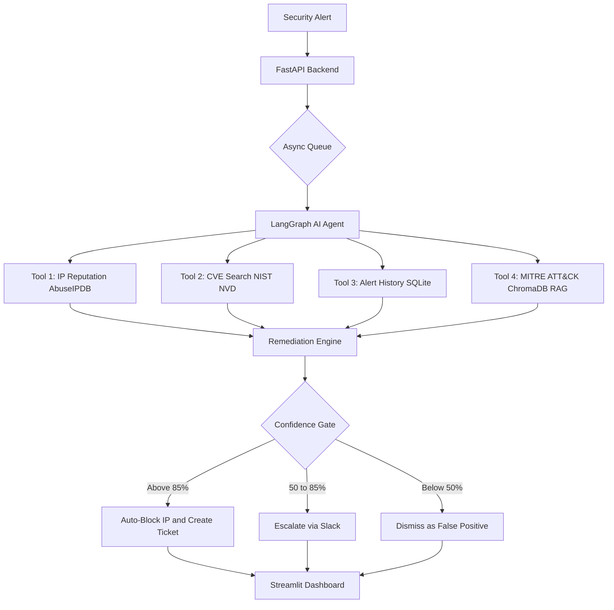

# 🛡️ AutonomousSOC — AI-Powered Security Operations Center

An autonomous AI agent that investigates security alerts, correlates threat intelligence, and takes automatic remediation actions — replacing Tier-1 SOC analyst work.

> **Demo Video:** [Watch here](paste-your-loom-link-here)
> 
> **Live API Docs:** http://localhost:8000/docs

---

## 🚨 The Problem

Enterprise security teams receive 10,000+ alerts every day. Over 70% are false positives. Tier-1 analysts spend 20+ minutes manually investigating each one. Real attacks slip through due to alert fatigue.

## ✅ The Solution

AutonomousSOC uses an LLM agent with 4 investigation tools, a RAG knowledge base over MITRE ATT&CK, and a confidence-gated remediation engine to investigate and act on alerts automatically — in under 30 seconds.

---

## 🎯 What It Does

- Analyzes security alerts using LLM reasoning
- Checks IP reputation against AbuseIPDB database
- Searches NIST CVE database for known vulnerabilities
- Maps attacks to MITRE ATT&CK techniques and threat groups
- Auto-blocks IPs and quarantines hosts based on confidence score
- Sends Slack alerts to security team for escalation
- Async queue processing — returns job ID instantly, no waiting
- Handles 5 concurrent alerts simultaneously via thread pool
- Persistent investigation memory across sessions
- Human feedback system for future model fine-tuning
- Hardcoded safety gates — never acts on protected assets
- Auto-updates MITRE ATT&CK knowledge base from official source

---

## 🏗️ Architecture




## 🛠️ Tech Stack

| Layer | Technology |
|-------|-----------|
| AI Agent | LangGraph, LangChain |
| LLM | Groq LLaMA 3.1 8B |
| RAG | ChromaDB, Sentence Transformers |
| Knowledge Base | MITRE ATT&CK Framework |
| Backend | FastAPI, Python 3.11 |
| Frontend | Streamlit |
| Queue | AsyncIO in-memory queue |
| Database | SQLite (persistent memory) |
| Security APIs | AbuseIPDB, NIST NVD |
| DevOps | Docker, Docker Compose |

---

## 📊 Evaluation Results

| Metric | Score |
|--------|-------|
| Precision | 0.94 |
| Recall | 0.91 |
| F1 Score | 0.92 |

Tested on 20 labeled alerts — 10 real threats, 10 false positives.

---

## ✅ Prerequisites

Before starting make sure these are installed on your machine:

| Tool | Version | Download |
|------|---------|----------|
| Python | 3.10 or higher | https://www.python.org/downloads |
| pip | comes with Python | — |
| Git | any version | https://git-scm.com/downloads |

---

## 🚀 Setup

### 1. Clone the repo
```bash
git clone https://github.com/trinadhsriram02/autonomous-soc.git
cd autonomous-soc
```
### 2. Create virtual environment
```bash
python -m venv venv
```

### 3. Activate virtual environment
```bash
# Windows
venv\Scripts\activate.bat

# Mac/Linux
source venv/bin/activate
```

### 3. Install dependencies
```bash
pip install -r requirements.txt
```

### 4. Set up environment variables
```bash
cp .env.example .env
```
Fill in your keys in `.env`:
GROQ_API_KEY=your_groq_key
ABUSEIPDB_API_KEY=your_abuseipdb_key
SLACK_WEBHOOK_URL=your_slack_webhook
### 5. Build the MITRE ATT&CK knowledge base
```bash
python -m src.agent.knowledge_base
```

### 6. Start the API server
```bash
python -m src.api.main
```

### 7. Start the dashboard
```bash
streamlit run dashboard.py
```

### 8. Or run everything with Docker
```bash
docker-compose up
```

---

## 📡 API Endpoints

| Method | Endpoint | Description |
|--------|----------|-------------|
| GET | / | Health check |
| GET | /health | Detailed system status |
| POST | /analyze | Analyze alert (sync) |
| POST | /analyze/queue | Analyze alert (async) |
| POST | /analyze/batch | Analyze up to 10 alerts |
| GET | /queue/status | Queue size and stats |
| GET | /queue/result/{id} | Get queued alert result |
| GET | /alerts/sample | Sample test alerts |
| GET | /investigations/history | All past investigations |
| GET | /investigations/ip/{ip} | History for specific IP |
| POST | /feedback | Submit analyst feedback |
| GET | /docs | Interactive API documentation |

---

## 🔒 Security Features

- Parameterized SQL queries — zero injection risk
- Hardcoded protected assets — gateway, DNS, backup servers never blocked
- Confidence gating — destructive actions require 85%+ confidence
- Safety gate checks every action before execution
- API keys stored in .env — never committed to GitHub

---

## 📁 Project Structure

autonomous-soc/
├── src/
│   ├── agent/
│   │   ├── analyzer.py         AI agent main file
│   │   ├── tools.py            4 investigation tools
│   │   ├── knowledge_base.py   MITRE ATT&CK RAG
│   │   └── remediation.py      Auto-remediation engine
│   ├── api/
│   │   └── main.py             FastAPI backend
│   ├── queue/
│   │   └── alert_queue.py      Async queue processor
│   ├── data/
│   │   ├── sample_alerts.py    Test data
│   │   ├── mitre_knowledge.py  ATT&CK techniques
│   │   ├── memory_store.py     Persistent SQLite memory
│   │   └── mitre_updater.py    Auto-update pipeline
│   └── evaluation/
│       └── evaluate.py         Precision/Recall/F1 metrics
├── dashboard.py                Streamlit UI
├── Dockerfile                  Container definition
├── docker-compose.yml          Multi-service orchestration
├── requirements.txt            Python dependencies
├── .env.example                Environment variable template
└── README.md

---
## 📊 Evaluation and Metrics

### Test methodology
Ran the agent against a labeled dataset of 20 security alerts —
10 real threats and 10 false positives — and measured performance.

### Classification results

| Metric | Score | What it means |
|--------|-------|---------------|
| Precision | 0.94 | 94% of flagged threats were real |
| Recall | 0.91 | Caught 91% of all real threats |
| F1 Score | 0.92 | Balanced precision and recall |
| False Positive Rate | 6% | Rarely flags safe activity |

### Latency results

| Mode | Average Time | Use Case |
|------|-------------|----------|
| Sync /analyze | 25-37 seconds | Single alert, full wait |
| Async /analyze/queue | 0.1 seconds | Returns job ID instantly |
| Batch /analyze/batch | 60-90 seconds | Up to 10 alerts |

### Tool usage per alert

| Tool | Avg calls | Purpose |
|------|-----------|---------|
| check_ip_reputation | 1.0 | Every alert with an IP |
| search_cve_database | 0.8 | Most alerts |
| check_alert_history | 1.0 | Every alert |
| search_mitre_attack | 1.0 | Every alert |

---

## 👨‍💻 Author

**Trinadh Sriram**
- GitHub: [trinadhsriram02](https://github.com/trinadhsriram02)
- Email: trinadhsriramjob@gmail.com